# 🚀 Centralized CI/CD Platform Setup for Multiple Applications using SharedJenkins Infrastructure

## 📌 Project Overview

This project demonstrates the implementation of a **centralized CI/CD platform using Jenkins** to automate the build, testing, security scanning, and deployment workflow for multiple applications.

The platform uses a centralized Jenkins controller with a shared Jenkins library and supports multiple application pipelines.

The project also implements:

- Jenkins Shared Libraries
- CI/CD pipelines
- Python application pipeline
- Node.js application pipeline
- Role-Based Access Control (RBAC)
- Jenkins Credentials Management
- Jenkins Agent configuration
- Automated build and testing
- Security scanning
- Centralized pipeline management

---

# 🏗️ Architecture

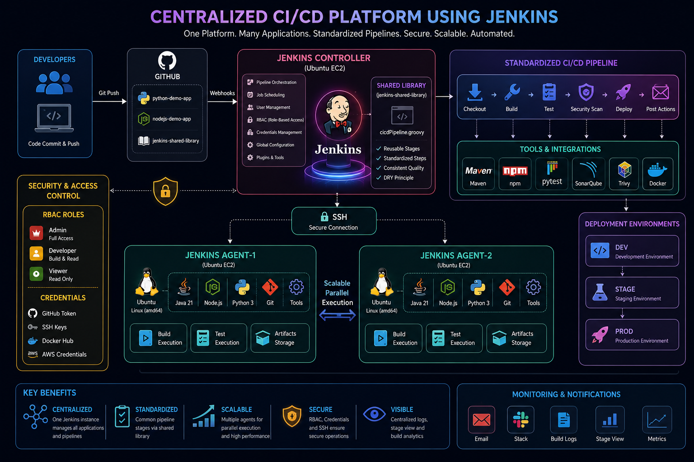
---

# 🎯 Project Objectives

The main objectives of this project are:

- Build a centralized Jenkins CI/CD platform.
- Integrate Jenkins with GitHub.
- Automate application pipelines.
- Create reusable Jenkins Shared Libraries.
- Support multiple programming languages.
- Implement RBAC using Jenkins Role-Based Authorization.
- Secure sensitive credentials using Jenkins Credentials.
- Configure Jenkins build agents.
- Standardize CI/CD stages across applications.
- Provide centralized visibility of application pipelines.

---

# 🛠️ Technologies Used

| Technology | Purpose |
|---|---|
| Jenkins | CI/CD automation |
| GitHub | Source code management |
| Git | Version control |
| Ubuntu | Jenkins Controller / Agent OS |
| Python | Python demo application |
| Node.js | Node.js demo application |
| Groovy | Jenkins Shared Library |
| Jenkins Shared Library | Reusable pipeline logic |
| SSH | Jenkins Agent communication |
| RBAC | Access control |
| Jenkins Credentials | Secret management |

---

# ☁️ Infrastructure

## Jenkins Controller

The Jenkins controller is hosted on an Ubuntu EC2 instance.

Example:

```text
Jenkins Controller
OS       : Ubuntu
Port     : 8080
Role     : Jenkins Controller
```

Jenkins is accessed using:

```text
http://<JENKINS_PUBLIC_IP>:8080
```


---

# 📂 Project Structure

```text
Centralized-CI-CD-Platform-using-Jenkins/
│
├── img/
│   ├── architecture.png
│   ├── aws-ec2.png
│   ├── jenkins-dashboard.png
│   ├── installed-plugins.png
│   ├── shared-library.png
│   ├── node-pipeline.png
│   ├── python-pipeline.png
│   ├── stage-view.png
│   ├── role-management.png
│   ├── credentials.png
│   └── agent-online.png
│
├── nodejs-demo-app/
│   ├── Jenkinsfile
│   ├── package.json
│   ├── test.js
│   └── README.md
│
├── python-demo-app/
│   ├── Jenkinsfile
│   ├── requirements.txt
│   ├── test_app.py
│   └── README.md
│
├── jenkins-shared-library/
│   ├── vars/
│   │   └── cicdPipeline.groovy
│   ├── src/
│   └── resources/
│
└── README.md
```

---

# 🔧 Phase 1 – Jenkins Installation

Jenkins was installed on an Ubuntu EC2 instance.

Verify Java:

```bash
java -version
```


Verify Jenkins:

```bash
sudo systemctl status jenkins
```

Start Jenkins:

```bash
sudo systemctl start jenkins
```

Enable Jenkins at boot:

```bash
sudo systemctl enable jenkins
```

Jenkins service:

```text
jenkins.service
```

Jenkins web interface:

```text
http://<JENKINS-IP>:8080
```

---

# 🔗 Phase 2 – GitHub Integration

The Jenkins platform integrates with GitHub repositories.

Application repositories:

```text
https://github.com/dhanashrechaudhari/python-demo-app.git
```

```text
https://github.com/dhanashrechaudhari/nodejs-demo-app.git
```

Shared Library repository:

```text
https://github.com/dhanashrechaudhari/jenkins-shared-library.git
```

Jenkins checks out the application source code from GitHub during pipeline execution.

---

# 📦 Phase 3 – Jenkins Shared Library

A reusable Jenkins Shared Library was created to standardize CI/CD pipelines.

Repository:

```text
jenkins-shared-library
```

Structure:

```text
jenkins-shared-library/
│
├── vars/
│   └── cicdPipeline.groovy
│
├── src/
│
└── resources/
```

The shared library contains reusable pipeline functionality.

Example:

```groovy
@Library('shared-lib') _

cicdPipeline()
```

The library allows different applications to reuse common CI/CD logic instead of duplicating pipeline code.

---

# 🔄 Phase 4 – Standard CI/CD Pipeline

The centralized pipeline follows these stages:

```text
Checkout
   ↓
Build
   ↓
Test
   ↓
Security Scan
   ↓
Deploy
   ↓
Post Actions
```

Jenkins Stage View provides centralized visibility of each stage.

---

# 🐍 Phase 5 – Python CI/CD Pipeline

Python application repository:

```text
python-demo-app
```

Repository:

```text
https://github.com/dhanashrechaudhari/python-demo-app.git
```

Application files:

```text
README.md
requirements.txt
test_app.py
Jenkinsfile
```

The pipeline performs:

```text
Checkout
   ↓
Build
   ↓
Test
   ↓
Security Scan
   ↓
Deploy
```

Python dependencies are installed in an isolated virtual environment to avoid the Ubuntu PEP 668 `externally-managed-environment` error.

Example:

```bash
python3 -m venv venv
source venv/bin/activate
pip install -r requirements.txt
```

Tests:

```bash
pytest
```

---

# 🟢 Phase 6 – Node.js CI/CD Pipeline

Node.js application repository:

```text
nodejs-demo-app
```

Example application files:

```text
Jenkinsfile
package.json
test.js
README.md
```

Pipeline stages:

```text
Checkout
   ↓
Build
   ↓
Test
   ↓
Security Scan
   ↓
Deploy
```

Node.js dependencies are installed using:

```bash
npm install
```

Tests are executed using the configured npm test command.

---

# 🔐 Phase 7 – Jenkins RBAC

Jenkins Role-Based Authorization Strategy was configured.

The following roles were created:

```text
Admin
Developer
Viewer
```

## Admin

The Admin role has administrative permissions.

Example permissions:

```text
Overall → Administer
Overall → Read

Job → Build
Job → Configure
Job → Create
Job → Delete
Job → Read
Job → Workspace

View → Configure
View → Create
View → Delete
View → Read
```

---

## Developer

The Developer role is intended for application developers.

Example permissions:

```text
Overall → Read

Job → Build
Job → Cancel
Job → Read
Job → Workspace

View → Read

SCM → Tag
```

Developers can run and inspect pipelines without receiving full Jenkins administration privileges.

---

## Viewer

The Viewer role is intended for read-only access.

Example permissions:

```text
Overall → Read

Job → Read

View → Read

SCM → Read
```

Viewers cannot modify or execute Jenkins jobs.

---

# 🔑 Phase 8 – Jenkins Credentials

Jenkins Credentials Management was configured to securely store authentication information.

Credentials can include:

```text
GitHub Personal Access Token
SSH credentials
Docker Hub credentials
AWS credentials
```

Credentials are referenced by their Jenkins credential ID rather than exposing secrets directly inside pipeline code.

Example:

```groovy
withCredentials([
    usernamePassword(
        credentialsId: 'dockerhub-credentials',
        usernameVariable: 'DOCKER_USER',
        passwordVariable: 'DOCKER_PASSWORD'
    )
]) {
    sh 'docker login -u "$DOCKER_USER" -p "$DOCKER_PASSWORD"'
}
```

### Security Note

Never commit:

```text
Passwords
Private SSH Keys
AWS Secret Keys
GitHub Tokens
Docker Hub Passwords
```

to GitHub.

Secrets should always remain inside Jenkins Credentials.

---

# 🖥️ Phase 9 – Jenkins Agent

A dedicated Jenkins Agent was created for distributed build execution.

Agent:

```text
agent-1
```

Operating System:

```text
Ubuntu
```

Architecture:

```text
Linux amd64
```

The intended architecture is:

```text
Jenkins Controller
        |
        | SSH
        |
        ▼
Jenkins Agent-1
        |
        ├── Build
        ├── Test
        └── Application Tasks
```

The agent provides a separate execution environment from the Jenkins controller.

---

# 🔐 Jenkins Agent SSH Authentication

The Jenkins controller connects to Agent-1 using SSH.

Example configuration:

```text
Host:
172.31.x.x

Port:
22

Username:
ubuntu

Credentials:
jenkins-agent-ssh-key
```

The SSH credential must contain the **private key corresponding to the public key stored in**:

```bash
/home/ubuntu/.ssh/authorized_keys
```

Test SSH connectivity from the Jenkins controller:

```bash
ssh -i <private-key> ubuntu@<agent-private-ip>
```

The expected result is a successful login:

```text
Welcome to Ubuntu
```

---

# 🧪 Phase 10 – Pipeline Validation

The pipelines were validated using Jenkins Stage View.

Expected successful pipeline:

```text
┌──────────┬────────┬──────┬────────┬───────────────┬────────┐
│ Checkout │ Build  │ Test │ Scan   │ Deploy        │ Status │
├──────────┼────────┼──────┼────────┼───────────────┼────────┤
│    ✓     │   ✓    │  ✓   │   ✓    │      ✓        │ SUCCESS│
└──────────┴────────┴──────┴────────┴───────────────┴────────┘
```

Jenkins displays the execution status of every pipeline stage.

---

# 🛡️ Security Implementation

Security controls implemented in this project include:

### RBAC

```text
Admin
Developer
Viewer
```

### Credential Management

Sensitive credentials are stored in:

```text
Jenkins → Manage Jenkins → Credentials
```

### SSH Authentication

Agent communication is performed using SSH keys.

### Shared Pipeline Logic

Common CI/CD logic is centralized in a Jenkins Shared Library.

### Source Control

Application source code and pipeline definitions are maintained in GitHub.

---

# 📸 Screenshots

The following screenshots should be included in the `img/` directory.

## AWS EC2


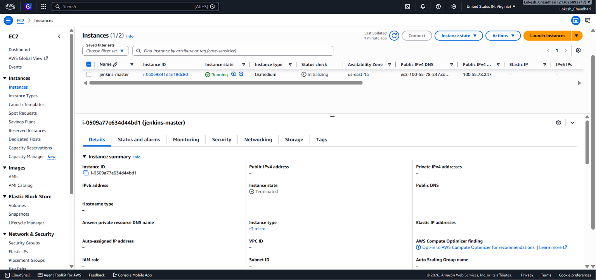


## Jenkins Dashboard


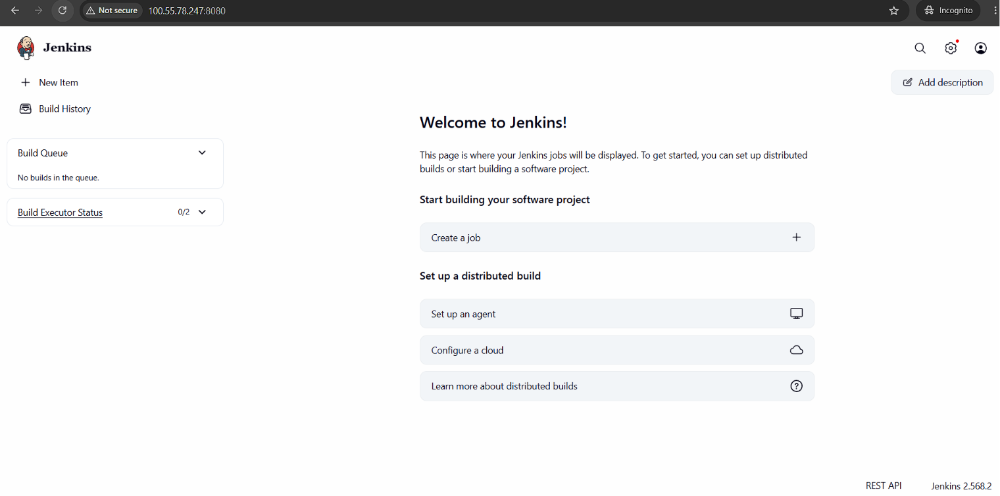


## Installed Plugins

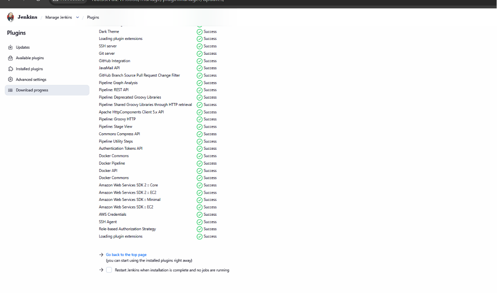

## Shared Library

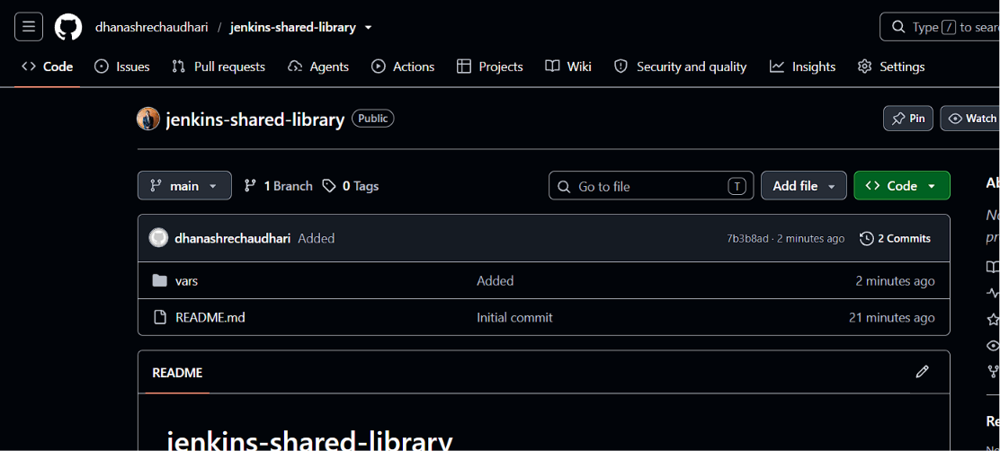

## Node.js Pipeline

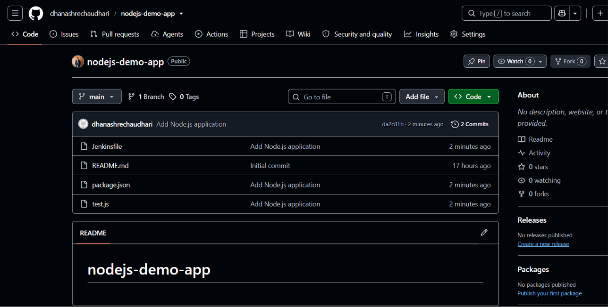

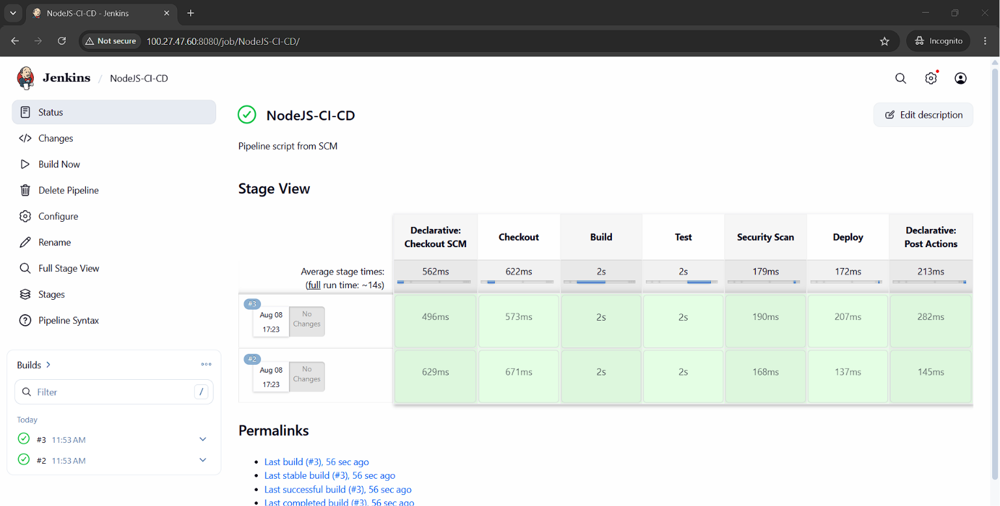


## Python Pipeline
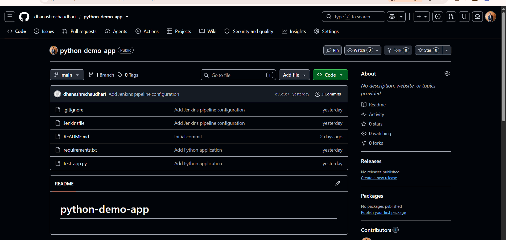

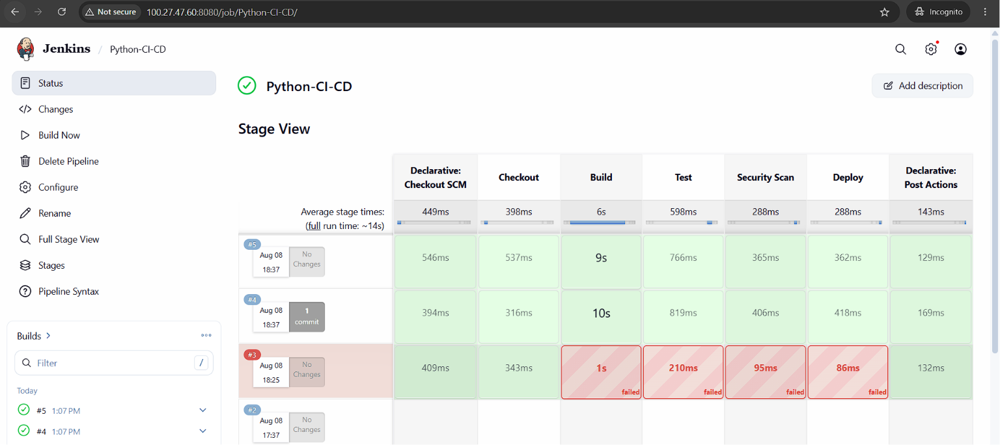

## RBAC

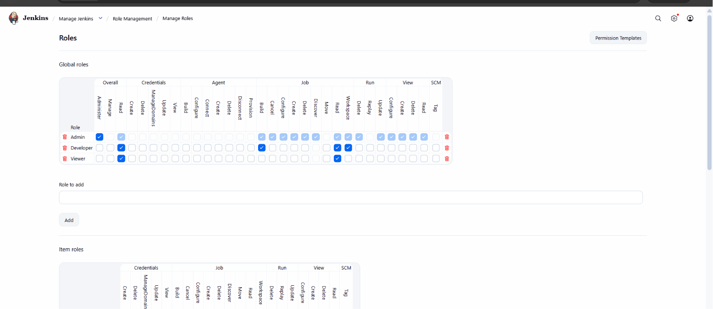

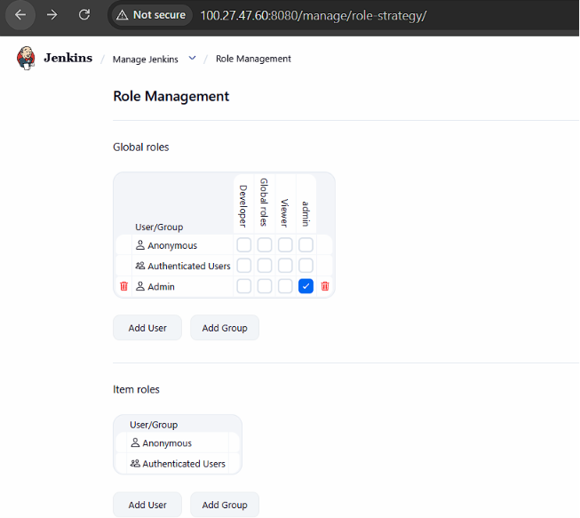

## Credentials

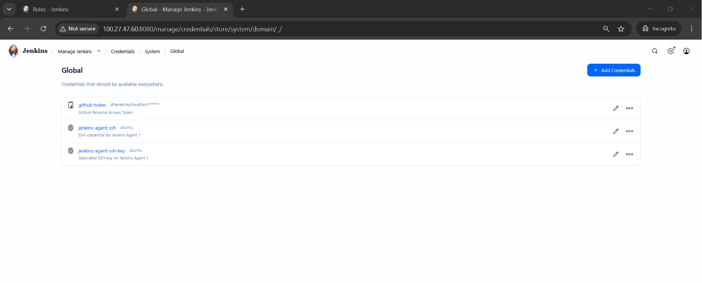

> **Important:** Credentials screenshots must not expose passwords, tokens, private keys, AWS secrets, or other sensitive information.

## Jenkins Agent

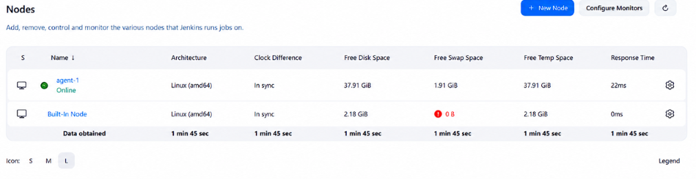

---

# 📈 Project Workflow

The complete workflow is:

```text
Developer
    |
    | Git Push
    ▼
GitHub
    |
    ▼
Jenkins Controller
    |
    ├── Checkout
    |
    ├── Shared Library
    |
    ├── Build
    |
    ├── Test
    |
    ├── Security Scan
    |
    └── Deploy
            |
            ▼
       Jenkins Agent-1
            |
            ▼
       Application
```

---

# ✅ Project Results

The project successfully demonstrates a centralized Jenkins CI/CD platform with:

- ✅ Jenkins Controller on Ubuntu
- ✅ GitHub source code integration
- ✅ Python CI/CD pipeline
- ✅ Node.js CI/CD pipeline
- ✅ Jenkins Shared Library
- ✅ Standardized CI/CD stages
- ✅ Jenkins RBAC
- ✅ Admin role
- ✅ Developer role
- ✅ Viewer role
- ✅ Jenkins Credentials Management
- ✅ SSH-based Jenkins Agent architecture
- ✅ Centralized Jenkins Stage View
- ✅ Automated application testing
- ✅ Security scanning stage
- ✅ Deployment stage
- ✅ Centralized CI/CD management

---

# 🎓 Learning Outcomes

Through this project, the following concepts were implemented:

### Jenkins

- Jenkins installation
- Jenkins configuration
- Pipeline creation
- Declarative pipelines
- Stage View
- Build management

### GitHub

- Repository integration
- SCM checkout
- Jenkinsfile management
- Git-based CI/CD

### Shared Libraries

- Reusable pipeline logic
- Centralized CI/CD standards
- Groovy-based Jenkins automation

### Security

- RBAC
- Jenkins Credentials
- SSH authentication
- Secret management

### Distributed Builds

- Jenkins Controller
- Jenkins Agent
- SSH-based agent communication

### DevOps

- Continuous Integration
- Continuous Testing
- Security scanning
- Continuous Deployment

---

# 🚀 Future Enhancements

The platform can be extended with:

```text
Docker
      ↓
Docker Hub / Amazon ECR
      ↓
Kubernetes
      ↓
AWS EKS
```

Additional improvements:

- SonarQube integration
- Trivy container scanning
- Docker image builds
- Amazon ECR integration
- Slack/Email notifications
- GitHub Webhooks
- Automatic deployment to AWS
- Kubernetes deployment
- HTTPS for Jenkins
- Backup and disaster recovery
- Monitoring with Prometheus and Grafana

---

# 🏁 Conclusion

This project demonstrates how Jenkins can be used as a **centralized CI/CD platform** for multiple applications.

By combining Jenkins Pipelines, Shared Libraries, GitHub integration, RBAC, Credentials Management, and distributed Jenkins Agents, the platform provides a scalable and secure foundation for automating software delivery.

The architecture can be extended to support additional applications, containers, cloud deployments, and Kubernetes environments.

---

# 👩‍💻 Author

**Dhanashri Chaudhari**

B.Tech – Information Technology

